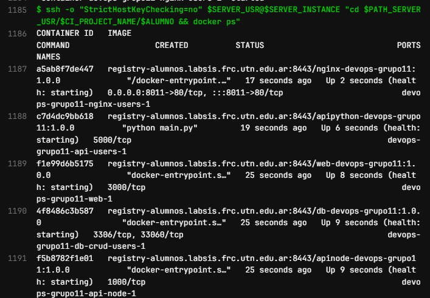
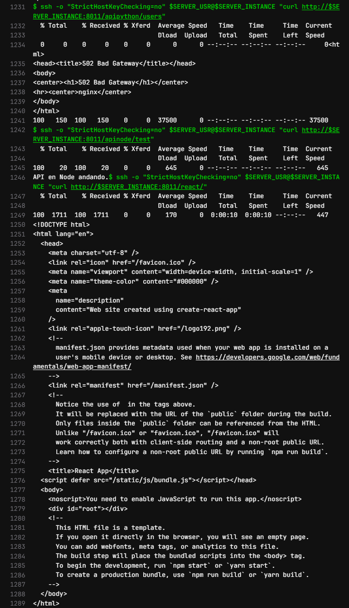

# Cómo probar

### 1. API con Python

`localhost:8080/apipython/health`

### 2. API con Node

`localhost:8080/apinode/test`

### 3. React

`curl http://localhost:8080/react/`

---

# Docker ps en el deploy

# Curls

